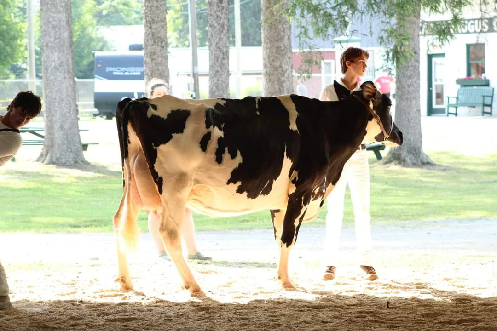
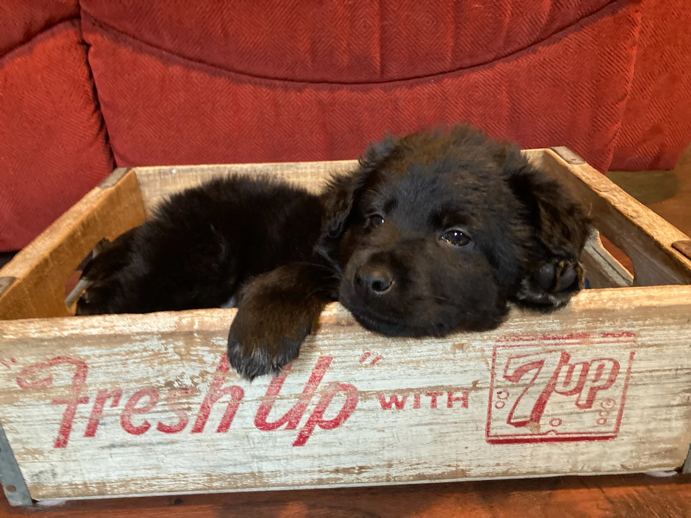

    

    <h1 style="font-size:4em;">Herd Genetics</h1>

[Herd Genetics](https://herdgenetics.com), a full stack web simulation, dedicated to teaching about animal genetics. ***Simulate breeding programs, focusing on PTAs, genetic recessives and inbreeding coefficients.*** Herd Genetics aims for accuracy of PTA/Trait correlations and trends. It is a classroom based system targeting group learning with every simulation belonging to a class.

Available at https://herdgenetics.com

    

## Compatability

Herd Genetics seeks to replace the original [Cow Progress](https://github.com/Owen-Dechow/cow_progress/tree/main) application. While Cow Progress only had support for Holstein Breeding programs, Herd Genetics make it a goal to diversify the possible animals through front animal filters. To maintain compatability legacy traitsets from the original simulation program have been imported into Herd Genetics. Those traitsets only allow for Bovine (Holstein) filters.

    

## System Changes

Although backwards compatability is impotent to Herd Genetics, certain systems have been replaced from the original program.

### 1. Inbreeding Calculator

The original Cow Progress program used an older version of [python-inbreeding](https://github.com/Owen-Dechow/inbreeding-python) to calculate inbreeding coefficients. Herd Genetics uses an updated version of that some package which accounts for inbreeding of common ancestors.

### 2. XLSX Files

Cow Progress allowed users to export data in a `.xlsx` file for analysis in Excel. Herd Genetics uses `.csv` files over the excel format due to size and speed benefits. CSV files can be loaded into Excel just as XLSX file would be.

    

